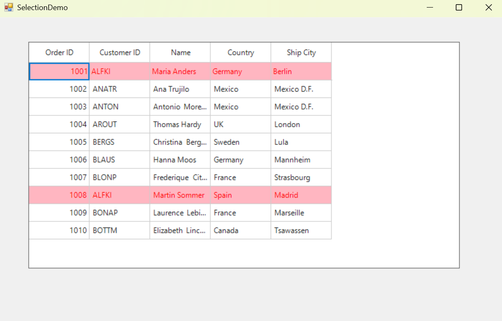

# How to prevent overriding of existing styles when selection is performed in WinForms DataGrid?

By default, in [WinForms DataGrid](https://www.syncfusion.com/winforms-ui-controls/datagrid) (SfDataGrid), when applying styles, the selection font color overrides the existing styles. However, the same font color style can be applied during selection by customizing the [DrawCell](https://help.syncfusion.com/cr/windowsforms/Syncfusion.WinForms.DataGrid.SfDataGrid.html#Syncfusion_WinForms_DataGrid_SfDataGrid_DrawCell) event.

Within this event, you can manually fill the rectangle and draw the text for the selected data rows with the required text color.

 ```csharp
//Event subscription
sfDataGrid.DrawCell += OnDrawCell;       

//Event customization
private void OnDrawCell(object sender, DrawCellEventArgs e)
{
    if (e.DataRow == null || e.DataRow.RowData == null || sfDataGrid.SelectedItems == null || sfDataGrid.SelectedItems.Count < 0 || sfDataGrid.CurrentCell == null)
        return;
    if ((e.DataRow.RowData as OrderInfo).CustomerID == "ALFKI" && sfDataGrid.SelectedItems.OfType<OrderInfo>().Select(item => item.CustomerID).Contains("ALFKI"))
    {           
        var paddedBounds = new Rectangle( e.Bounds.X + 1, e.Bounds.Y + 1, e.Bounds.Width - 2, e.Bounds.Height - 2);
        e.Style.TextColor = Color.Red;
        StringFormat format = new StringFormat();
        DrawingHelper drawingHelper = new DrawingHelper();
        if (e.Column.CellType == "Numeric")
             e.Style.HorizontalAlignment = HorizontalAlignment.Right;
        var horizontalAlignment = drawingHelper.GetType().GetMethod("ConvertToStringAlignment", System.Reflection.BindingFlags.NonPublic | System.Reflection.BindingFlags.Static, Type.DefaultBinder, new Type[] { typeof(HorizontalAlignment) }, new ParameterModifier[] { }).Invoke(drawingHelper, new object[] { e.Style.HorizontalAlignment });
        var verticalAlignment = drawingHelper.GetType().GetMethod("ConvertToStringAlignment", System.Reflection.BindingFlags.NonPublic | System.Reflection.BindingFlags.Static, Type.DefaultBinder, new Type[] { typeof(VerticalAlignment) }, new ParameterModifier[] { }).Invoke(drawingHelper, new object[] { e.Style.VerticalAlignment });
        format.Alignment = (StringAlignment)horizontalAlignment;
        format.LineAlignment = (StringAlignment)verticalAlignment;
        if(e.ColumnIndex != sfDataGrid.CurrentCell.ColumnIndex)
            e.Graphics.FillRectangle(new SolidBrush(sfDataGrid.Style.SelectionStyle.BackColor), e.Bounds);
        e.Graphics.DrawString(e.DisplayText, e.Style.GetFont(), new SolidBrush(e.Style.TextColor), paddedBounds, format);
        e.Graphics.DrawLine(new Pen(e.Style.Borders.Right.Color), e.Bounds.Right - 1, e.Bounds.Top, e.Bounds.Right - 1, e.Bounds.Bottom);
        e.Graphics.DrawLine(new Pen(e.Style.Borders.Bottom.Color), e.Bounds.Left, e.Bounds.Bottom - 1, e.Bounds.Right, e.Bounds.Bottom - 1);
         // For drawn the current cell
        if (e.ColumnIndex == sfDataGrid.CurrentCell.ColumnIndex)
             e.Column.Renderer.OnDrawCurrentCell(e.Graphics, sfDataGrid, new RowColumnIndex(sfDataGrid.CurrentCell.RowIndex, sfDataGrid.CurrentCell.ColumnIndex));
         // For handling the event
        e.Handled = true;
    }
 }
 ```
 

Take a moment to peruse the [WinForms DataGrid-Selection](https://help.syncfusion.com/windowsforms/datagrid/selection) documentation, to learn more about DataGrid Selections with examples.